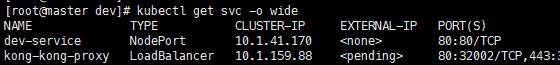

# dev-ingress
一个简单的k8s-ingress，开发代理神器
# 背景
K8S集群内部的服务在外部不能访问，如需外部访问需要ingress做代理。官方有nginx-ingress，安装配置比较麻烦，想弄个简单的，只需要提交个表单就能配置完成的那种。

想到之前写的一个开发联调神器dev-proxy可以做简单的代理使用，配置方便。把她部署在k8s集群里是否就能直接配置服务了。。想到就做。。。。

k8s的nodePort端口（默认为30000-32767）我使用下面的方式修改的端口，可能有不同改法，自行百度
```
vim /etc/kubernetes/manifests/kube-apiserver.yaml 
--service-node-port-range=80-65535
```
# 部署到k8s集群
```
kubectl apply -f k8s.yaml
kubectl apply -f dev-service.yaml
```
# 服务配置

- 访问集群中任意节点 http://ip/admin即可打开配置页面
- 如下图，有 kong-kong-proxy 服务在运行
```
# 查看集群中的服务
kubectl get svc -o wide
```

- 配置填写：kong=>kong-kong-proxy（后缀=>k8s的服务名，即可访问）
- 访问 http://ip/kong 即可看到效果